<h1 align="center">Romain Galland</h1>

  <strong>C++ Software · Desktop Applications · Open Source</strong>

  Geneva, Switzerland ·
  <a href="https://github.com/Infomaniak">Infomaniak</a>

  

## About

I'm a French software engineer focused on cross-platform desktop applications,
systems programming, and open-source software.

At [Infomaniak](https://github.com/Infomaniak), I contribute to
[kDrive Desktop](https://github.com/Infomaniak/desktop-kDrive), the synchronization
client for Infomaniak's privacy-focused collaborative cloud. For the past several
months, my main focus has been developing its Linux-specific interface redesign
with Qt/QML, a project I will continue working on over the coming months.

I'm currently completing the first year of a Master's degree in Systems and
Software Engineering through a work-study program. Rather than continuing into
the second year, I'll transition to a permanent role at Infomaniak in September
2026.

I care about building reliable software that gives people transparency, privacy,
and control over their data. I'm also interested in self-hosting, system
administration, and developer tooling.

## Technical focus

  
  
  
  
  

- **Core:** C++, C, Qt
- **Tooling and systems:** Conan, Bash, PowerShell, Linux, GitHub Actions
- **Also experienced with:** Python, Java, Dart and Flutter

## Selected work

| Project | What it is | Stack |
| --- | --- | --- |
| [**kDrive Desktop**](https://github.com/Infomaniak/desktop-kDrive) | Cross-platform synchronization client for Infomaniak's collaborative cloud. | C++ · Qt/QML · Linux |
| [**Matomo SDK for Qt**](https://github.com/Infomaniak/matomo-sdk-qt) | Client SDK for the Matomo Tracking API. | C++ · Qt |
| [**rdap-tui**](https://github.com/R-Gld/rdap-tui) | Secure terminal client for the Registration Data Access Protocol. | C++20 |
| [**Rika Firenet Unofficial App**](https://github.com/R-Gld/RikaFirenetUnofficialApp) | Application for remotely controlling and monitoring RIKA stoves, with smart notifications, an Android widget, and multilingual support. | Dart · Flutter |

## GitHub activity

  <picture>
    <source
      media="(prefers-color-scheme: dark)"
      srcset="./profile/stats-dark.svg"
    >
    <source
      media="(prefers-color-scheme: light), (prefers-color-scheme: no-preference)"
      srcset="./profile/stats-light.svg"
    >
    
  </picture>

  Interested in C++, desktop engineering, open source, or privacy-friendly
  software? Feel free to connect with me on
  <a href="https://www.linkedin.com/in/rgld/">LinkedIn</a>.

